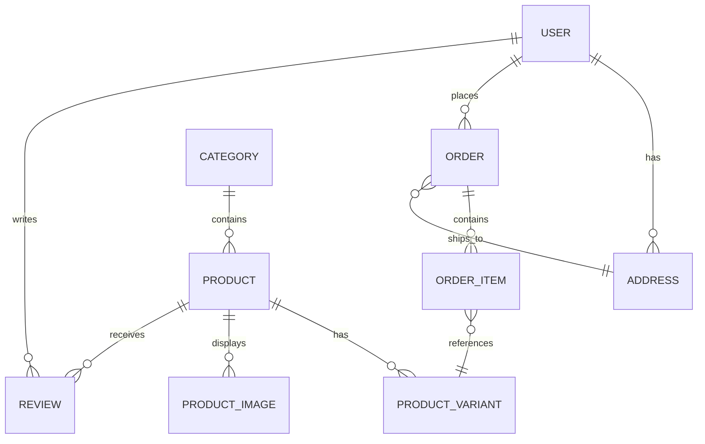

# Database Schema & Data Model Design

**Project Name:** Dehydrated Foods E-Commerce Website
**Date:** 2026-05-31
**Version:** 1.0
**Target Database:** PostgreSQL (using Prisma ORM)

## 1. Overview
This document outlines the relational database schema required to power the robust e-commerce features of the application. It covers Users, Products (and variants like sizes/weights), Categories, Orders, and Reviews.

---

## 2. Entity-Relationship Diagram (ERD)

---

## 3. Tables and Relationships

### 3.1. Users & Authentication

**Table: `User`**
Stores authentication and high-level user data.
- `id` (UUID, Primary Key)
- `email` (String, Unique)
- `passwordHash` (String, nullable for OAuth users)
- `firstName` (String)
- `lastName` (String)
- `role` (Enum: `USER`, `ADMIN`) - Default `USER`
- `createdAt` (Timestamp)
- `updatedAt` (Timestamp)

**Table: `Address`**
Stores multiple addresses for users (shipping/billing).
- `id` (UUID, Primary Key)
- `userId` (UUID, Foreign Key -> `User.id`)
- `type` (Enum: `SHIPPING`, `BILLING`)
- `streetAddress1` (String)
- `streetAddress2` (String, nullable)
- `city` (String)
- `stateProvince` (String)
- `postalCode` (String)
- `country` (String)
- `isDefault` (Boolean) - Default `false`

### 3.2. Product Catalog

**Table: `Category`**
Allows organizing dehydrated goods (e.g., "Vegetables", "Fruit Powders").
- `id` (UUID, Primary Key)
- `name` (String)
- `slug` (String, Unique) - For SEO-friendly URLs (e.g., `/category/fruit-powders`)
- `description` (Text, nullable)
- `imageUrl` (String, nullable)

**Table: `Product`**
The core product entity that groups the details together.
- `id` (UUID, Primary Key)
- `categoryId` (UUID, Foreign Key -> `Category.id`)
- `name` (String)
- `slug` (String, Unique) - For SEO-friendly URLs (e.g., `/product/dehydrated-carrots`)
- `shortDescription` (String)
- `detailedDescription` (Text)
- `nutritionalInfo` (JSON) - Stores calories, vitamins per serving, etc.
- `ingredients` (String)
- `isActive` (Boolean) - Default `true`
- `createdAt` (Timestamp)
- `updatedAt` (Timestamp)

**Table: `ProductVariant`**
Crucial for dehydrated foods sold by weight (e.g., 100g, 500g, 1kg).
- `id` (UUID, Primary Key)
- `productId` (UUID, Foreign Key -> `Product.id`)
- `sku` (String, Unique) - Stock Keeping Unit
- `weightGrams` (Integer) - E.g., `500`
- `price` (Decimal/Float) - Exact price for this specific weight
- `stockQuantity` (Integer) - Real-time inventory count

**Table: `ProductImage`**
Stores multiple images per product.
- `id` (UUID, Primary Key)
- `productId` (UUID, Foreign Key -> `Product.id`)
- `url` (String)
- `altText` (String)
- `isPrimary` (Boolean) - Identifies the main thumbnail image
- `sortOrder` (Integer)

### 3.3. Ordering System

**Table: `Order`**
The main order invoice record.
- `id` (UUID, Primary Key)
- `userId` (UUID, Foreign Key -> `User.id`, nullable for guest checkouts)
- `guestEmail` (String, nullable)
- `shippingAddressId` (UUID, Foreign Key -> `Address.id`)
- `status` (Enum: `PENDING`, `PAID`, `PROCESSING`, `SHIPPED`, `DELIVERED`, `CANCELLED`)
- `subtotal` (Decimal)
- `shippingCost` (Decimal)
- `tax` (Decimal)
- `totalAmount` (Decimal)
- `stripeSessionId` (String, Unique, nullable)
- `stripePaymentIntentId` (String, Unique, nullable)
- `createdAt` (Timestamp)
- `updatedAt` (Timestamp)

**Table: `OrderItem`**
Line items within an order, locking in the price at the time of purchase.
- `id` (UUID, Primary Key)
- `orderId` (UUID, Foreign Key -> `Order.id`)
- `productVariantId` (UUID, Foreign Key -> `ProductVariant.id`)
- `quantity` (Integer)
- `priceAtPurchase` (Decimal) - Important: Do not rely solely on the live variant price for historical orders.

### 3.4. Community & Feedback

**Table: `Review`**
Provides social proof for products.
- `id` (UUID, Primary Key)
- `productId` (UUID, Foreign Key -> `Product.id`)
- `userId` (UUID, Foreign Key -> `User.id`)
- `rating` (Integer, 1-5)
- `comment` (Text)
- `isApproved` (Boolean) - Default `false` (Requires admin moderation)
- `createdAt` (Timestamp)

---

## 4. Key Implementation Notes
- **Prisma Schema (`schema.prisma`):** We will map these definitions exactly into Prisma format to automatically strongly-type our Next.js backend and React client data fetching.
- **Data Integrity:** Cascading deletes (e.g., `onDelete: Cascade`) will be implemented cautiously. Deleting a Product should delete its ProductImages and ProductVariants, but deleting an Order or User must be handled softly (e.g., replacing the user ID with a null/anonymous marker to preserve sales history).
- **Decimals vs Floats:** For currency (`price`, `totalAmount`), use `Decimal` types or store as integers (cents) to avoid floating-point arithmetic errors.
